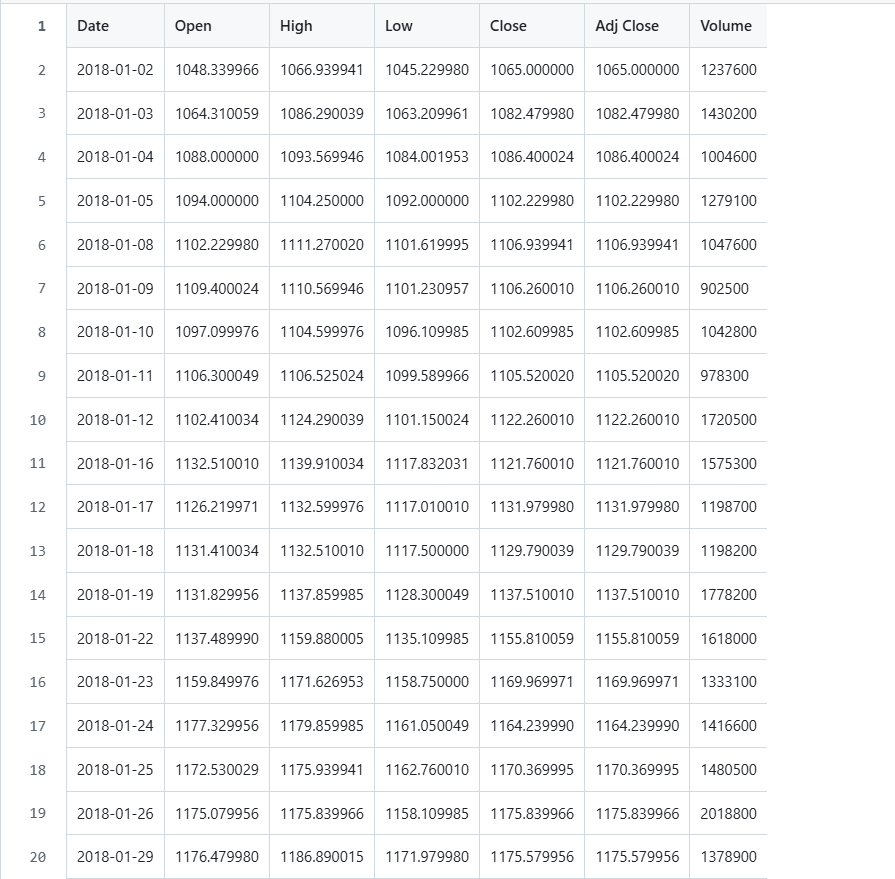
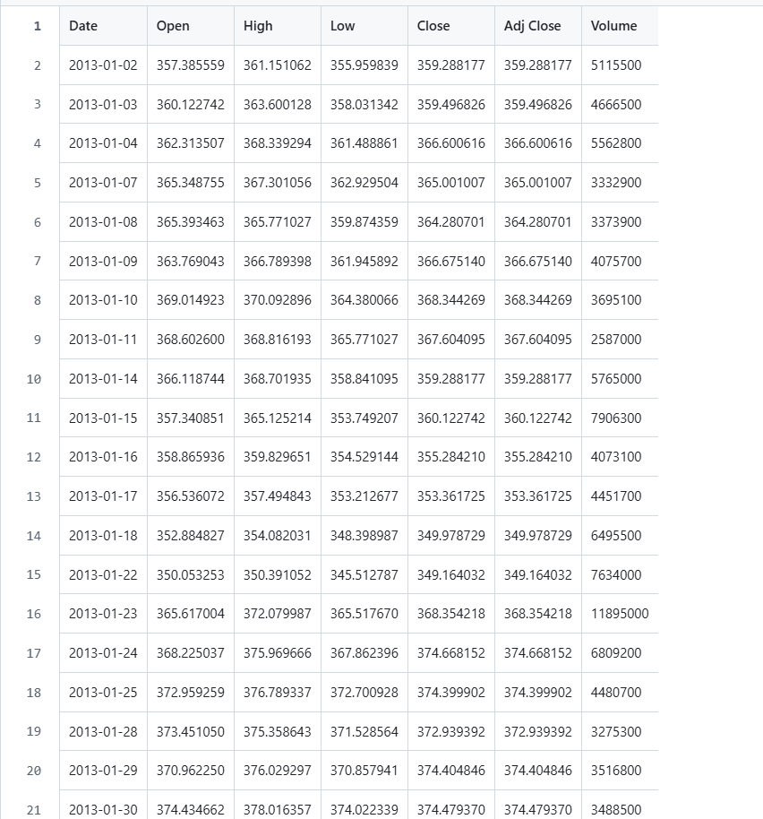
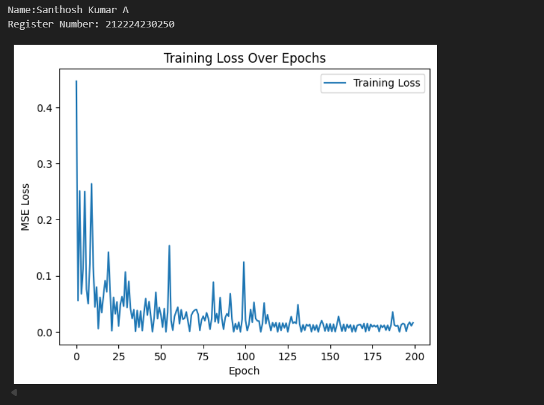
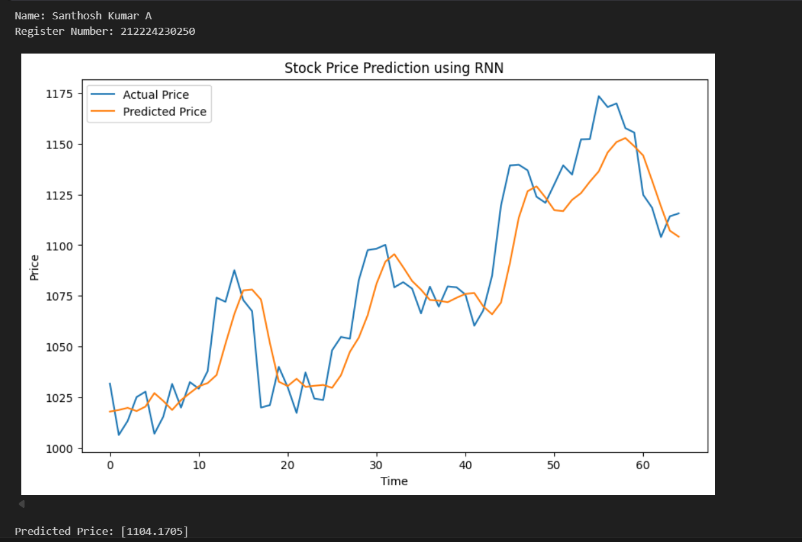

# Stock-Price-Prediction


## AIM

To develop a Recurrent Neural Network model for stock price prediction.

## Problem Statement and Dataset




## Design Steps

Step 1:
Import necessary libraries.

Step 2:
Load and preprocess the data.

Step 3:
Create input-output sequences.

Step 2:
Convert data to PyTorch tensors.

Step 3:
Define the RNN model.

Step 2:
Train the model using the training data.

Step 3:
Evaluate the model and plot predictions.


## Program
#### Name: SANTHOSH KUMAR A
#### Register Number:21224230250

```
# Define RNN Model
class RNNModel(nn.Module):
  def __init__(self, input_size=1, hidden_size=64, num_layers=2, output_size=1):
    super(RNNModel, self).__init__()
    self.rnn = nn.RNN(input_size, hidden_size, num_layers, batch_first = True)
    self.fc = nn.Linear(hidden_size, output_size)

  def forward(self,x):
    out, _ = self.rnn(x)
    out = self.fc(out[:, -1, :])
    return out

model = RNNModel()
device = torch.device("cuda" if torch.cuda.is_available() else "cpu")
model = model.to(device)


# Train the Model
epochs = 20
model.train()
train_losses = []
for epoch in range(epochs):
  epoch_loss = 0
  for x_batch, y_batch in train_loader:
    x_batch, y_batch = x_batch.to(device), y_batch.to(device)
    optimizer.zero_grad()
    outputs = model(x_batch)
    loss = criterion(outputs, y_batch)
    loss.backward()
    optimizer.step()
    epoch_loss += loss.item()
  train_losses.append(epoch_loss / len(train_loader))
  print(f"Epoch [{epoch+1}/{epochs}], Loss:{train_losses[-1]:.4f}")

```

## Output

### True Stock Price, Predicted Stock Price vs time



### Predictions 



## Result

The RNN model successfully predicts future stock prices based on historical closing prices. The predicted prices closely follow the actual prices, demonstrating the model's ability to capture temporal patterns. The performance of the model is evaluated by comparing the predicted and actual prices through visual plots.


